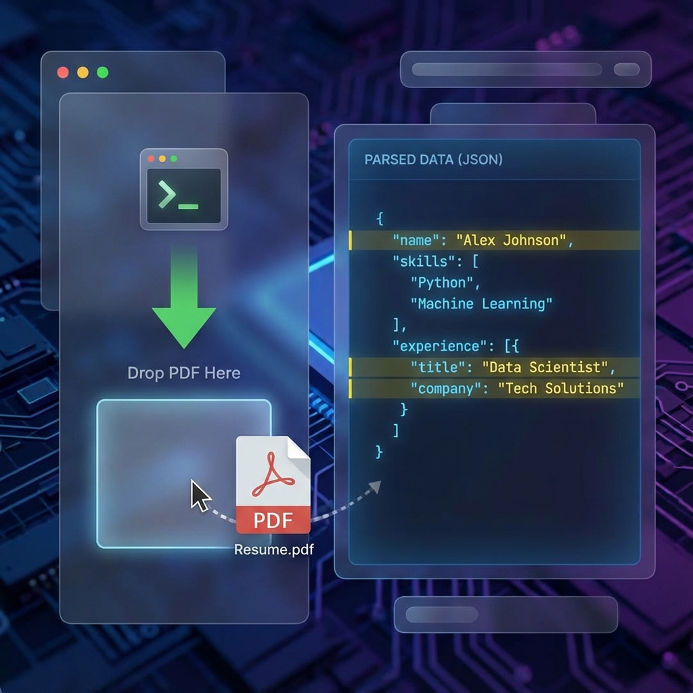

# 📄 Resume-Parser: Intelligent Recruitment Agent



> **"From raw resumes to structured intelligence in seconds."**

An advanced, agentic resume screening pipeline that transforms unstructured resume data into actionable JSON insights. Designed for high-volume recruitment automation with a focus on precision and agentic reasoning.

---

## 🛠️ The Problem
Recruiters spend **~23 hours** screening resumes for a single hire. Most automated tools rely on primitive keyword matching, missing high-potential candidates who use different terminology.

## 💡 The Solution: R1 Agent
The **R1 Agent** is a multi-stack (TS/Python) intelligence layer that goes beyond keywords:
- **Heuristic Parsing**: Advanced regex and pattern recognition for extracting education, experience, and certifications.
- **Smart Evaluation**: Weighted scoring based on years of experience, skill proficiency, and education level.
- **Agentic Logic**: Capable of handling uncertainty and providing detailed reasoning for every pass/fail decision.
- **Bulk Processing**: Integrated Excel support for screening one candidate against hundreds of job descriptions simultaneously.

---

## 🚀 One-Click Install

### TypeScript/React Stack
```bash
npm install
npm.cmd run build
```

### Python Extension Stack (Optional)
```bash
pip install -r requirements.txt
```

---

## 🏃 How to Run

### Development Mode
```bash
# Start Frontend
npm.cmd run dev:frontend

# Run Screening Agent (Node.js)
npm.cmd run dev:agent
```

### Run Tests
```bash
npm.cmd test
```

---

## 📊 Results & JSON Output
The R1 Agent spits out a standardized JSON schema ready for any ATS integration:

```json
{
  "candidate": "Jane Smith",
  "result": "PASS",
  "confidenceScore": 0.85,
  "matchReasons": [
    "✓ 5 years of experience",
    "✓ Has required technical skills",
    "✓ Meets education requirements"
  ],
  "parsedData": {
    "skills": ["TypeScript", "Node.js", "React"],
    "experience": "Senior Developer at Tech Corp"
  }
}
```

---

## 🔗 Live Demo
**Hosted on Streamlit; drop any resume PDF, get JSON back.**

---

**Built with ❤️ for Master's Level Excellence.**